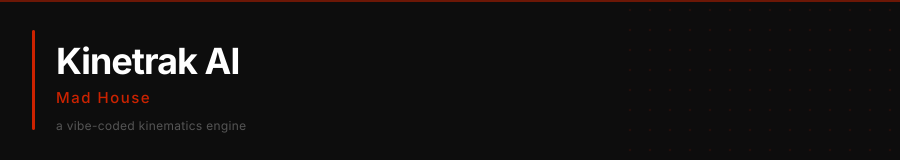

<a href="#what-it-does"></a>&nbsp;<a href="#controls"></a>&nbsp;<a href="#tech-stack"></a>&nbsp;<a href="#get-started"></a>

---

Real-time body and face tracking in the browser using [MediaPipe Holistic](https://developers.google.com/mediapipe/solutions/vision/holistic_landmarker). Tracks full-body pose, hands, and facial landmarks simultaneously and renders them as an overlay on live camera feed.

## What it does

- Tracks body pose (12 joint connections), both hands (21 landmarks each), and full facial topology (lips, eyes, brows, face oval) in real time
- Renders landmark skeletons as vector overlays on a canvas
- Three display modes: color video with overlay, black and white with overlay, tracking-only (skeleton on black)
- Exports live rig data over WebSocket for use by downstream tools (game engines, motion capture pipelines, etc.)
- High-frequency telemetry HUD showing FPS and landmark data

## Controls

| Key | Action |
|-----|--------|
| `C` | Color video mode |
| `B` | Black and white mode |
| `T` | Tracking only (skeleton on black background) |

## Tech stack

- React 19 + TypeScript
- MediaPipe Holistic (loaded from CDN)
- Vite
- Google Generative AI SDK

## Getting started

```bash
npm install
npm run dev
```

Open `http://localhost:5173` and allow camera access. The tracker starts automatically.

### WebSocket output

The engine broadcasts solved rig data on `ws://localhost:8080`. Messages are JSON with type `RIG_SOLVED` and a `data` payload containing the landmark arrays. Connect any compatible consumer to receive live tracking data.

## Notes

- Requires a webcam
- Runs entirely in the browser, no server-side processing for tracking
- Model complexity is set to 1 (balanced speed/accuracy). Adjust `modelComplexity` in `components/BodyTrackEngine.tsx` if needed
